# Wolt Test Assignment Report

This repository contains the code for preparing training, test datases, training and evaluating a Long-Short Term Memory (LSTM) Recurrent Neural Network (RNN) LSTM and baseline Linear Regression models for predicting courier partners online.

# 1 Introduction

The problem of predicting time series is crucial for the future activity planning. The dataset given contains extreaction of the daily courier number dataset combined with the weather data.
Cleaning this data as described in README.md file results in the following time series shown in the figure below. There is clear correlation between weather variables and courier numbers.

---

# 2 Exploratory Data Analysis
Let us have a look at the correlation matrix first. Besides weather charactiristics we add also 'day_of_week_i' dummy variable with $i=0..6$. Here  'day_of_week_0' corresponds to Monday.

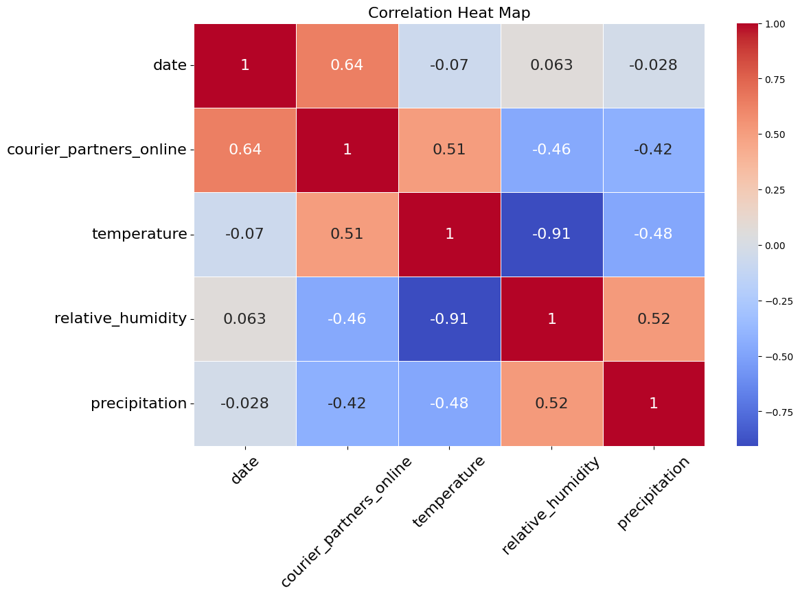

One can see that the larges correlation for 'courier_partner_online' is with 'temperature', and then with 'precipitation'. Correlation with 'humidity' is also large but at the same time 'humidity' itself is almost deterministically correlated with 'precipitation', so that it should not add new prediction power for the model. There is significant correlation with several 'day_of_week_i' variables.
Therefore we choose 'temperature', 'precipitation' and 'day_of_week_i' as features. However, later we will see that the most important features are the historical values of the 'courier_partner_online' and 'temperature'.

To visualise high correlations between weather-related variables we use scatter plots below.
They suggest that only one of these variables, for example 'temperature' should have a predicting power.

---

# 3 Prediction Tasks

## 3a Next-Day Task

The Next-Day task consists of predicting the value of the  $ y_{i+1} $ (representing 'courier_partners_online') for the next day based on the historical values available up to day $ i $. Formally, this can be written as:
$$
y_{i+1} = f(x_{1:i}),
$$
where:
 - $ y_{i+1} $ is the predicted value for the next day.
 - $ x_{1:i} $ represents the features (e.g., temperature, precipitation, day of the week, courier partners online) up to day $ i $.
 - $ f $ is the predictive model.

## 3b Multiple-Day Task
The Multiple-Day task consists of predicting the values of the variable
$ y_{i+1}, y_{i+2}, ..., y_{i+ n_{step}} $ for the next $n_{step} $ days based on the historical values available up to day $ i $. Formally, this can be expressed as:
$$
y_{i+1:i+n_{step}} = f(x_{1:i}),
$$
where: $ y_{i+1:i+n_{step}} = \{y_{i+1}, y_{i+2}, ..., y_{i+n_{step}}\} $ are the predicted values for the next $n_{step} $ days,  $ x_{1:i} $ represents the features up to day $ i $, $ f $ is the predictive model.

---

# 4 Feature Selection

Features $x_{1:i}$ consist of values of the variables 'courier_partner_online' 'temperature', 'precipitation', 'day_od_week_0', ... 'day_od_week_6'. In totat there are 10 different variables.
The number of preceeding days is taken to be limited, so that features are $x_{i-train_days : i}$.
The number of preceding days 'train_days' can be different. We take it to be = 40.

Since we use 10 feature and 40 preceeding days, tho total numnber of features is 400.

---

# 5 Models

## 5a Baseline: Linear regression models

We use simple Linear Regression model from sklearn library. For the next-day prediciton task we use usual `LinearRegression()` with scalar target variable.
For the multiple-day prediction task we use `MultiOutputRegressor(LinearRegression())`
which is capable of predicting multiple target variables. The number of parameters in Linear Regression model is equal to the number of features, that is 400.

## 5b LSTM Regressor Model with Dropout Regularization

More advance approach is a Recurrent Neural Network (RNN), namely a multi-layer Long Short-Term Memory (LSTM) neural network designed for regression tasks.
It uses dropout regularization to prevent overfitting and is built using the Keras Sequential API. Below are the details of the architecture:

1. **Input Shape**: `(timesteps, features)`
2. **Layers**:
   - **LSTM Layer 1**: 100 units, returns sequences, followed by a 30% dropout.
   - **LSTM Layer 2**: 80 units, returns sequences, followed by a 10% dropout.
   - **LSTM Layer 3**: 50 units, returns sequences, followed by a 20% dropout.
   - **LSTM Layer 4**: 30 units, does not return sequences, followed by a 30% dropout.
   - **Dense Layer**: Fully connected output layer with `n_steps` units.
3. **Loss Function**: Mean Squared Error (`mse`)
4. **Optimizer**: Adam

The diagram below illustrates the architecture:

---

# 6 Metrics

Mean Absolute Error (MAE)
$$
    \text{MAE} = \frac{1}{n} \sum_{i=1}^{n} \left| y_i - \hat{y}_i \right|
$$

Root Mean Squared Error (RMSE)
$$
    \text{RMSE} = \sqrt{
        \frac{1}{n} \sum_{i=1}^{n} \left( y_i - \hat{y}_i \right)^2
        }
$$

Signal-to-Noise Ratio (SNR)

$$
 \text{SNR (dB)} = 10 \log_{10}
 \left(
    \frac{
          \sum_{i=1}^{n} \hat{y}_i^2
        }
        {
           \sum_{i=1}^{n} \left( y_i - \hat{y}_i \right)^2
        }
 \right)
$$

The R² (R-squared) score, also known as the coefficient of determination
$$
R^2 = 1 - \frac{\sum_{i=1}^{n} (y_i - \hat{y}_i)^2}{\sum_{i=1}^{n} (y_i - \bar{y})^2}
$$

Here
-$ y_i $ and  $ \hat{y}_i $ The actual value of courier numbers on the (i)-th day.
- $ \hat{y}_i $: The predicted value at the (i)-th position.
- $ n $: The total number of observations.
These equations provide a mathematical representation of the error metrics used to evaluate the performance of regression models.

---

# 7 Learning curves

For the LSTM model optimization precedure consists of several Epochs and we need to choose the optimal number of Epoch to avoid overfitting. For this the validation set is chosen as the single time series interval consistsing of 10% of the available data.
The learning curve with training and validation losses are shown in the figure below.
From that we see that overfitting starts approximately from 30 Epoch.
Thus for training LSTM models we choose 30-40 Eposchs.

# 8 Results

### 8a Next-day courier number predictions

Quantitative metrics measuring model performance for the Next-day prediciton task

| Model               | MAE  |  RMSE  | SNR   |  R2  |
|---------------------|------|--------|-------|------|
| LSTM                | 2.92 | 3.93   | 25.61 | 0.35 |
| Linear Regression   | 3.04 | 3.90   | 25.67 | 0.36 |

The plots below show comparison of real data with model prediction for the Next-day task

    

        <h3>Next-day courier number: LSTM</h3>
        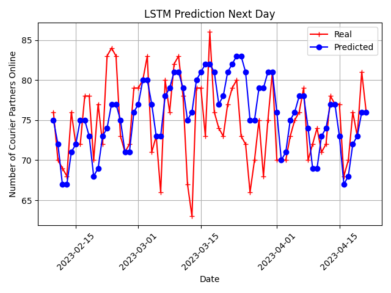
    

    

        <h3>Next-day courier number: Linear regression</h3>
        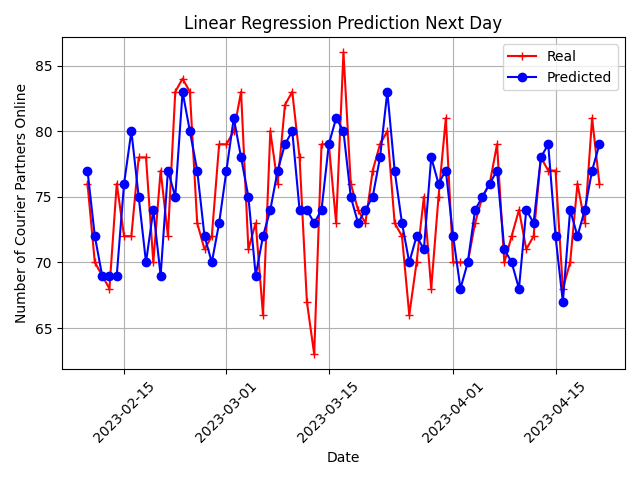
    

---

### 8b Several-day courier number predictions

Quantitative metrics measuring model performance for the Next-day prediciton task

| Model               | MAE     |  RMSE   |  SNR   | R2    |
|---------------------|---------|---------|--------|-------|
| LSTM                | 3.43    | 4.32    | 24.95  | 0.29  |
| Linear Regression   | 3.51    | 4.36    | 24.71  | 0.17  |

The plots below show comparison of real data with model prediction for the Multiple-day task

    

        <h3>20-day courier number: LSTM</h3>
        
    

    

        <h3>20-day courier number: Linear regression</h3>
        
    

    

        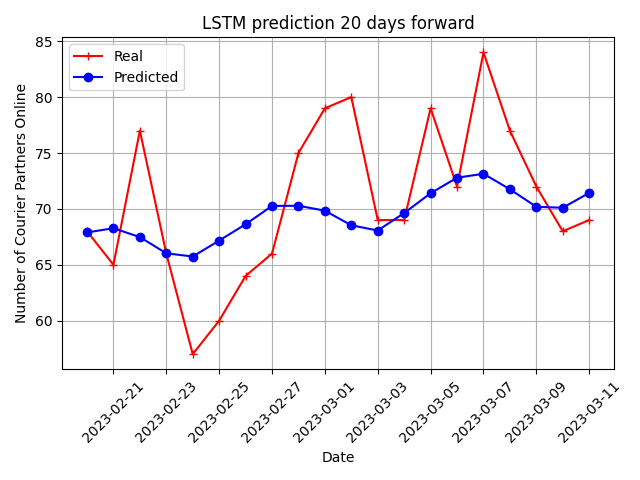
    

    

        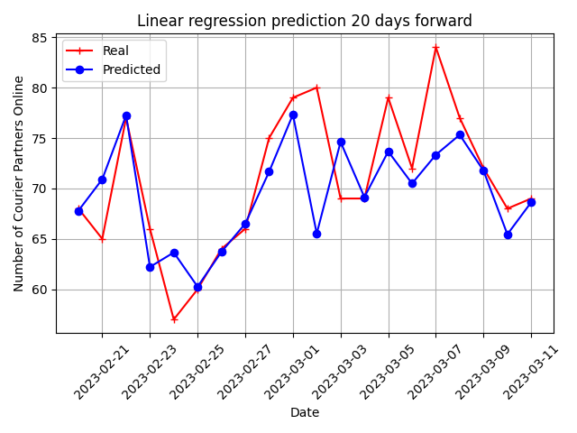
    

    

        
    

    

        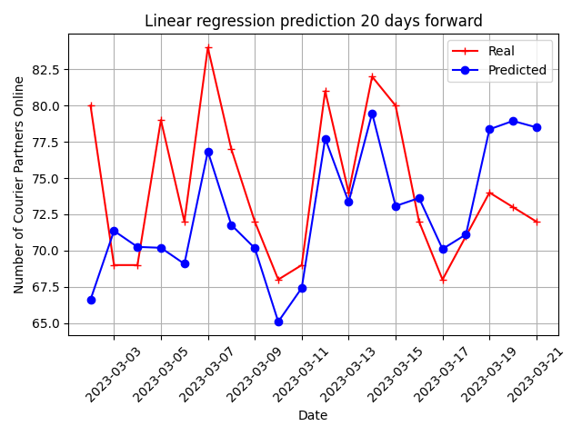
    

    

        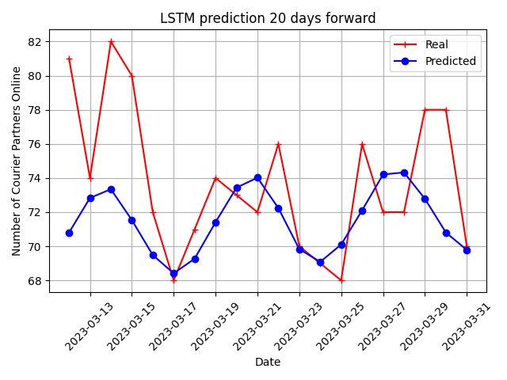
    

    

        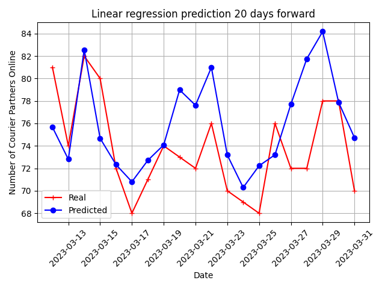
    

    

        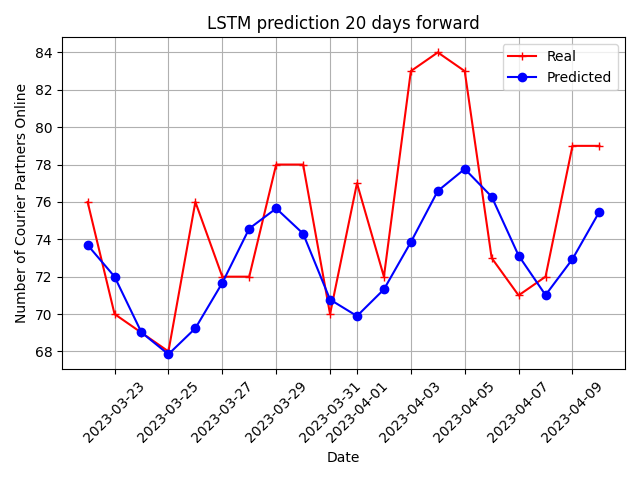
    

    

        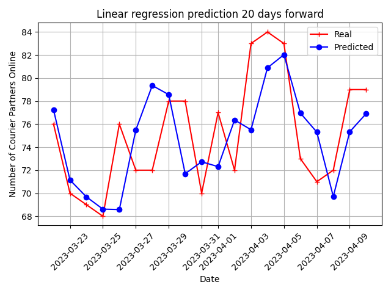
    

    

        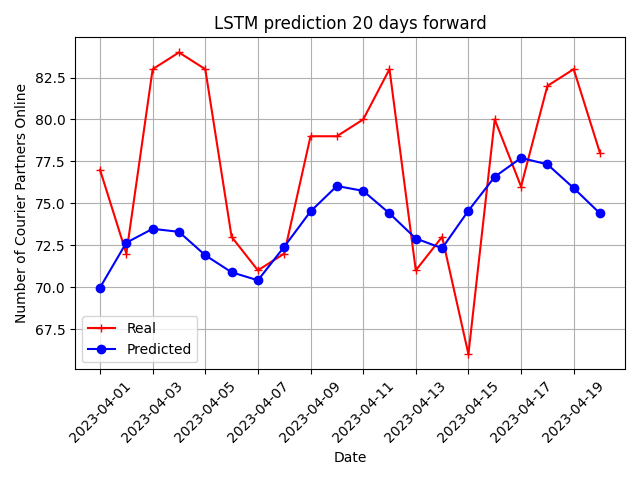
    

    

        
    

    

        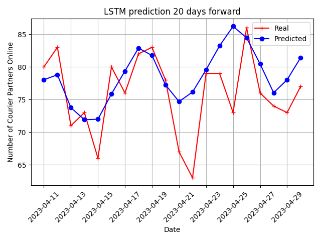
    

    

        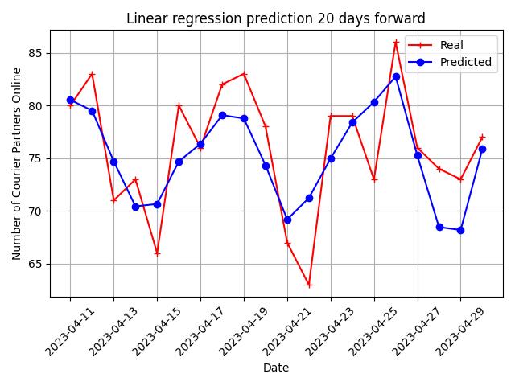
    

---

# 9 Analysis of feature importance

To analyse predictive pover of different features we perform permutation importance analysis ising 'permutation_importance' method from skrlearn library. This method allwos to estimate the change in model accuracy with adding or removing certain feature.
The obtained feature importance plot for the Linear Regression model is shown below. From this we see that the most important features are the 'courier_partners_online' and 'temperature' historical values. Standard deviation intervals are shown by the error bars.

---
# 10 Conclusion

We see that both LSTM models and baseline Linear regression models predict to some extent the courier number for the single next day and for the multiple days (for example 20 days) ahead. The quantitative metrices such as RMSE, Signal-to-Noise Ratio (SNR), R-squared show decent performance. The values of R-squared score are about 0.2-0.3 which can be considered as a good value.

For the Next-Day task LSTM and Linear regression models show almost similar performance. For Multiple-Day task LSTM is a bit better. However, its performance strongly depends on parameters, such as the batch size.

As a direction of further improvement we can use hyperparametr optimization for LSTM to see how changing parameters such as number of days in the feature vector, batch size, number of units in each layer change the residual errors. Besides that, increasing the length of time series dataset will also provide model performance improvement.
